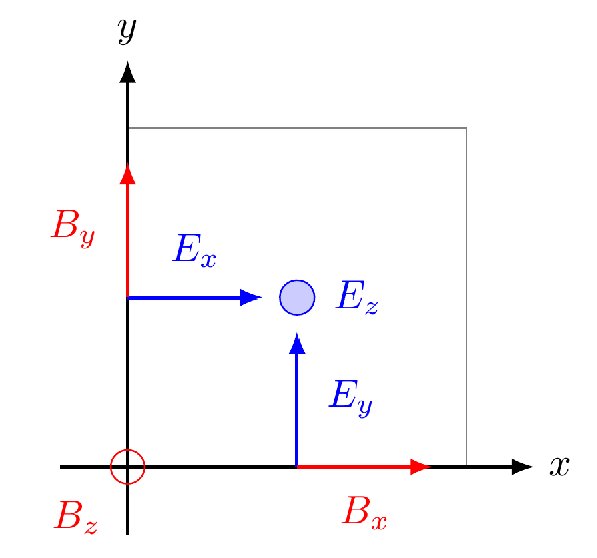

# Physics 427 Homework 8

__Due 11:59pm Wednesday 11/6/2024__

## 1. Advection Equation in 1D (20 points)

Let's implement a numerical method to solve the simple 1D advection equation:

$$
\frac{\partial u}{\partial t} + v\frac{\partial u}{\partial x} = 0
$$

In a C++ header file `problem1.h`, implement the Lax-Wendroff method to solve the advection equation. Your function should have the following signature:
    
```cpp
std::vector<double> lax_wendroff(const std::vector<double> &u,
                                 double v, double dx, double dt);
```

where `u` is the array of values of $u$ at the current time step, `v` is the advection velocity, `dx` is the grid spacing, and `dt` is the time step. The function should return a `std::vector<double>` that contains the values of $u$ at the next time step. Use one ghost cell on each side of the domain to implement periodic boundary conditions. The output array should have periodic boundary conditions already applied.

In a separate C++ source file `problem1.cpp`, write a program that uses your `lax_wendroff` function to solve the advection equation for the following initial condition on a domain $x\in [0, 1]$:

$$
u(x, 0) = e^{-(x - 0.5)^2/\sigma^2}, \quad \sigma = 0.05.
$$

Use a grid with $N_x = 1000$ (remember there is a ghost cell at each end to enforce periodic boundary condition, so only $998$ are physical cells) and a time step $\Delta t = 0.9\Delta x / v$. Use an advection velocity of $v = 1.0$. Run your simulation for a total time of $t = 5.0$. Create an output every time $t$ elapses by $0.02$, and write the values of $u$ in a csv file. Plot the outputs and create a movie of the evolution of $u$ in time. You can use the included `plot_problem1.py` script to make the plots, but also feel free to write your own version. To create the movie, install the package `ffmpeg` using your package manager (`apt-get` in WSL, or `brew` on Mac), and then run the following command in a terminal:
```bash
ffmpeg -framerate 10 -i u_%03d.png -c:v libx264 -vf "pad=ceil(iw/2)*2:ceil(ih/2)*2" -pix_fmt yuv420p problem1.mp4
```
This command will take in all the `png` files under the current directory named in the form of `u_001.png`, use `libx264` as the video encoder, pad the image to have even number of pixels on both width and height, and make a movie `problem1a.mp4` using the `yuv420p` pixel format. Commit the resulting `problem1a.mp4` to the repository. DO NOT COMMIT CSV FILES OR BINARY FILES TO THE REPOSITORY!

Once you are done, repeat your calculation with a square wave initial condition:

$$
u(x, 0) = \begin{cases}
1.0, \quad 0.4 < x < 0.6 \\
0.0, \quad \mathrm{otherwise}
\end{cases}
$$

Simulate the same duration and create a movie `problem1b.mp4`. Commit it to the repository. You should get a similar result as what was shown in class. Feel free to play around with the solver using different initial conditions. You don't need to commit other results to the repo, but it may be fun to see what this solver will do in different scenarios.

## 2. Time-dependent Maxwell Equations in 2D (30 points)

In this problem, we will try to solve the Maxwell equations in 2D. We will use the staggered Yee lattice for 2nd order accuracy in both space and time. The equations we are solving are (these are written in Lorenz-Heaviside units with $c = 1$):

$$
\begin{split}
\frac{\partial \mathbf{E}}{\partial t} &= \nabla \times \mathbf{B} - \mathbf{J} \\
\frac{\partial \mathbf{B}}{\partial t} &= -\nabla \times \mathbf{E}
\end{split}
$$

Let's start with a 2D grid of $N_x \times N_y$. A given grid cell is labeled by an index tuple $(i, j)$. In this problem we will not implement a periodic boundary condition, since its effect will be quite similar to a reflective boundary, which we dont need to do anything. Even though the grid is only 2D, all 6 components of the electromagnetic fields need to be defined. The fact that the grid is 2D simply means that the partial derivative with respect to $z$ is zero, $\partial/\partial z = 0$. The Yee lattice is defined as follows for a given cell:



From this convention, one can write down the discretized Maxwell equations. For example, the update of $E_x$ looks like:

$$
\Delta E_{x,i,j} = \Delta t \left( \frac{B_{z,i,j+1} - B_{z,i,j}}{\Delta y} - J_x\right)
$$

where $i$ and $j$ label cells in the $x$ and $y$ directions, respectively. This is the standard Finite Difference Time Domain (FDTD) method for solving the Maxwell equations. Note that $\mathbf{E}$ is naturally defined half a time step apart from $\mathbf{B}$ so that the time update will be using centered difference. This is handled by updating $\mathbf{E}$ by half a time step at the very beginning of the simulation.

Your goal is to implement a solver for Maxwell equations in 2D. I have included a skeleton file, `maxwell.h`, for you to fill in. In particular, you need to finish the two functions `update_e` and `update_b`. The former one will take a source function `J` that specify the time dependent current that sources the electromagnetic field. Commit the finished file `maxwell.h` to the repository.

In a new source file, `problem2a.cpp`, use the Maxwell solver you implemented to find the radiation from an oscillating current source. In particular, use a current function similar to the following:

```cpp
double J(int n, int i, int j, double t) {
  // This function creates an oscillating Jz at the center of the domain
  if (n != 2 || i != Nx / 2 || j != Ny / 2) {
    return 0.0;
  } else {
    return J0 * sin(omega * t);
  }
}
```

Run the solver for a total physical time of approximately $T = 1.0$, which is the light-crossing time of the simulation box. Write the out-of-plane electric field $E_z$ in a series of `.csv` files. Create a movie of this process in Python and commit it to the repository as `problem2a.mp4`. Do remember to include a colorbar to show the scale of the colormap. Choose your amplitude of the current `J0` and frequency `omega` such that you see several wavelengths of spherical wave inside the box, and that the wave has maximum amplitude of order $\sim 1$. Note what happens when the wave hits the boundary.

The current function above represents a current oscillating in the $z$ direction. Change the current to be in the $y$ direction instead. Run the simulation again, but this time write $B_z$ as outputs. Since the current is oscillating within the $xy$ plane, we should be able to see the angular dependence of the electromagnetic wave. Create a movie of this process and commit it as `problem2b.mp4`. Commit your modified C++ source file as `problem2b.cpp`. DO NOT COMMIT CSV FILES OR BINARY FILES TO THE REPOSITORY!